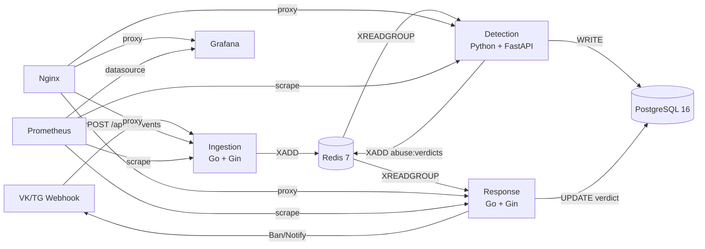

# ADR-P — Abuse Detection & Response Platform

Микросервисная платформа для сбора телеметрии о злоупотреблениях из Telegram/VK, обнаружения аномалий в реальном времени и автоматического реагирования.

## Архитектура



## Быстрый старт

```bash
git clone https://github.com/Samuraiprm/ADR-P.git
cd ADR-P
docker compose up -d
```

Сервисы:
| Сервис | URL | Описание |
|--------|-----|----------|
| Ingestion | http://localhost/api/v1/events | Приём webhook'ов |
| Response | http://localhost/api/v1/rules | API управления |
| Detection | http://localhost/detection/health | Health check |
| Grafana | http://localhost/grafana | Дашборд (admin/admin) |
| Prometheus | http://localhost/prometheus | Метрики |

## API

### Отправка события

```bash
curl -X POST http://localhost/api/v1/events \
  -H "Content-Type: application/json" \
  -d '{
    "source": "telegram",
    "event_type": "message",
    "timestamp": 1234567890,
    "payload": {"text": "hello"}
  }'
```

Ответ:
```json
{"event_id": "550e8400-e29b-41d4-a716-446655440000"}
```

### Список правил

```bash
curl http://localhost/api/v1/rules
```

### Создание правила

```bash
curl -X POST http://localhost/api/v1/rules \
  -H "Content-Type: application/json" \
  -d '{
    "name": "rate_limit",
    "condition_json": "{\"window_sec\": 60, \"threshold\": 10}",
    "action": "BLOCK"
  }'
```

### Статистика

```bash
curl "http://localhost/api/v1/stats?from=2026-01-01T00:00:00Z&to=2026-12-31T23:59:59Z"
```

### Health check

```bash
curl http://localhost/healthz
curl http://localhost/response/healthz
curl http://localhost/detection/health
curl http://localhost/nginx/health
```

## Стек

| Компонент | Технология |
|-----------|-----------|
| Ingestion | Go 1.24, Gin, Redis Stream |
| Detection | Python 3.12, FastAPI, scikit-learn, Isolation Forest |
| Response | Go 1.24, Gin, Telegram Bot API |
| Storage | PostgreSQL 16, Redis 7 |
| Proxy | Nginx |
| Мониторинг | Prometheus + Grafana (11 панелей) |

## Метрики

Prometheus метрики доступны на `/metrics` в каждом Go-сервисе:

**Ingestion:** `adr_received_events_total`, `adr_validated_events_total`, `adr_dropped_events_total`, `adr_http_requests_total`, `adr_http_duration_seconds`

**Response:** `adr_verdicts_consumed_total`, `adr_verdicts_processed_total`, `adr_verdicts_failed_total`, `adr_telegram_messages_sent_total`, `adr_telegram_callbacks_handled_total`, `adr_rules_created_total`, `adr_db_operations_total`, `adr_response_redis_healthy`, `adr_response_postgres_healthy`

**Detection:** `adr_events_consumed_total`, `adr_events_processed_total`, `adr_events_failed_total`, `adr_rule_matches_total`, `adr_ml_anomaly_score`, `adr_ml_trained`, `adr_ml_samples`

## CI/CD

GitHub Actions: lint (go vet) → test (go test -race) → Docker build → push.

## Структура проекта

```
ADR-P/
├── ingestion/          # Go — приём webhook'ов
│   ├── handlers/       # HTTP handlers
│   ├── metrics/        # Prometheus метрики
│   ├── middleware/      # Logger, API key auth
│   └── redis/          # Redis Stream клиент
├── detection/          # Python — детекция аномалий
│   ├── engine/         # Rules engine + ML (Isolation Forest)
│   ├── db/             # SQLAlchemy модели
│   └── metrics/        # Prometheus метрики
├── response/           # Go — реагирование
│   ├── handlers/       # API + Telegram callback
│   ├── services/       # Verdict consumer + Response actions
│   ├── metrics/        # Prometheus метрики
│   └── db/             # SQL queries
├── grafana/            # Dashboard JSON + datasource
├── nginx/              # Reverse proxy
├── prometheus/         # Scrape config
└── docker-compose.yml  # Orchestration (7 сервисов)
```
