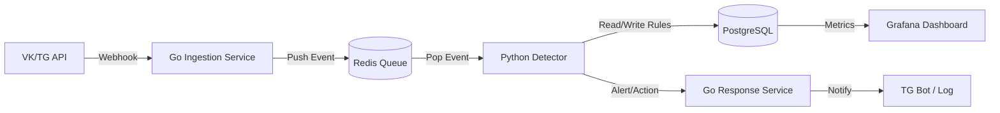

# Архитектура и технологический стек проекта ADR-P

## 1. Описание системы
ADR-P (Abuse Detection & Response Platform) — это микросервисная платформа для сбора телеметрии из внешних источников (Telegram/VK), детекции аномалий в реальном времени и автоматизированного реагирования. Система предназначена для демонстрации навыков L2-антифрод-аналитика и инженера.

## 2. Целевой стек
- **Ingestion & API:** Go 1.22+, Gin/Echo, Redis (Stream/List as queue).
- **Detection Engine:** Python 3.12+, Pandas, Scikit-learn/CatBoost, SQLAlchemy.
- **Storage:** PostgreSQL 16+ (основные данные), Redis (кэш/очередь).
- **Infra:** Docker Compose, Nginx (reverse proxy), Prometheus + Grafana.
- **CI/CD:** GitHub Actions (lint, test, build).

## 3. Схема взаимодействия

